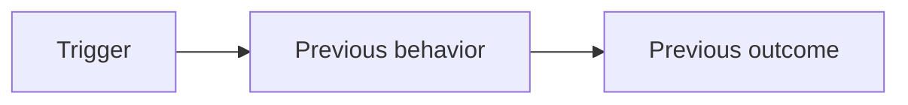
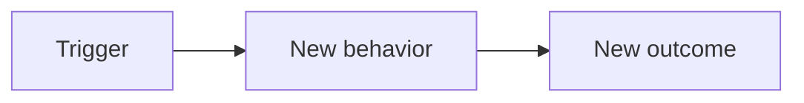

<!-- Replace placeholders with facts from this task. Do not invent prompts or validation results. -->

## Summary

<!-- Explain the problem and the resulting behavior. -->

## Issue

<!-- Required: link an existing GitHub issue. Use Refs instead of Closes for partial work. -->

Closes #<issue-number>

## Before

<!-- Replace this example with a small diagram of the previous behavior or workflow. -->

## After

<!-- Replace this example with a comparable diagram of the new behavior or workflow. -->

## Prompts and approach

<!-- Summarize the user request and relevant follow-up prompts that shaped the change, then explain the implementation approach. Omit secrets and private context. -->

## Decisions

<!-- Explain meaningful choices, alternatives considered, and tradeoffs. Write "No significant tradeoffs" when applicable. -->

## Validation

<!-- List checks actually performed and their results, or explain what was not tested and why. -->
